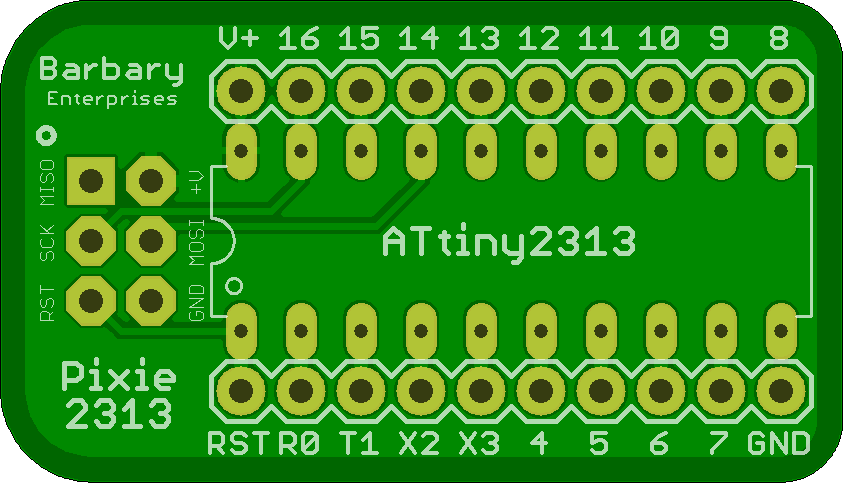

## Pixie 2313 / 4313

A very bare minimum breakout for an ATtiny2313 to provide the AVR ICSP programming header to the micro controller. 

## Pixie2313 

### Board dimensions

* (140000, 80000) original units
* (1.4000, 0.8000) inches
* (35.5600, 20.3200) mm

| Front | Back |
| --- | --- |
|  |  |

